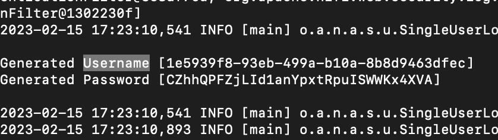
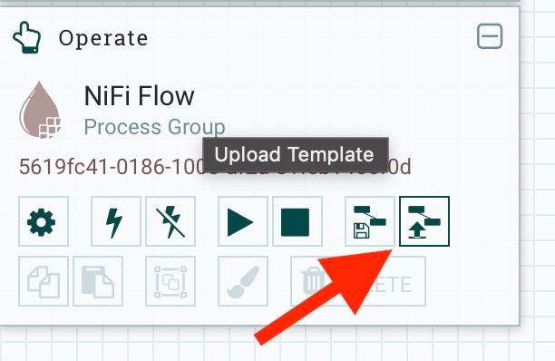
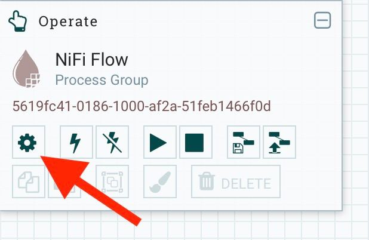
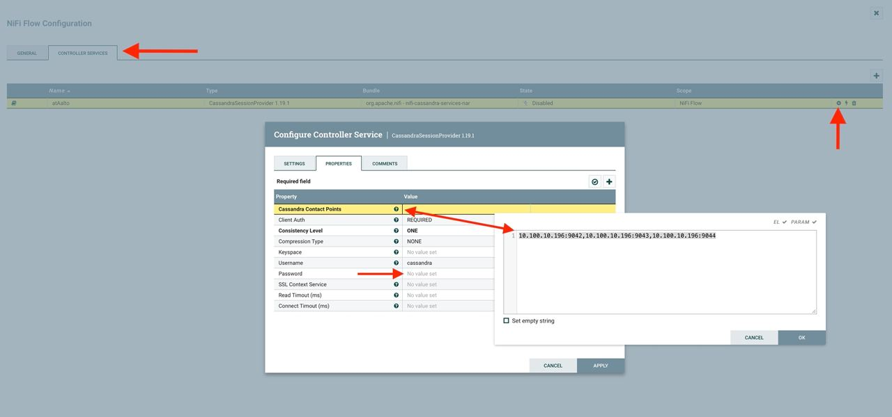
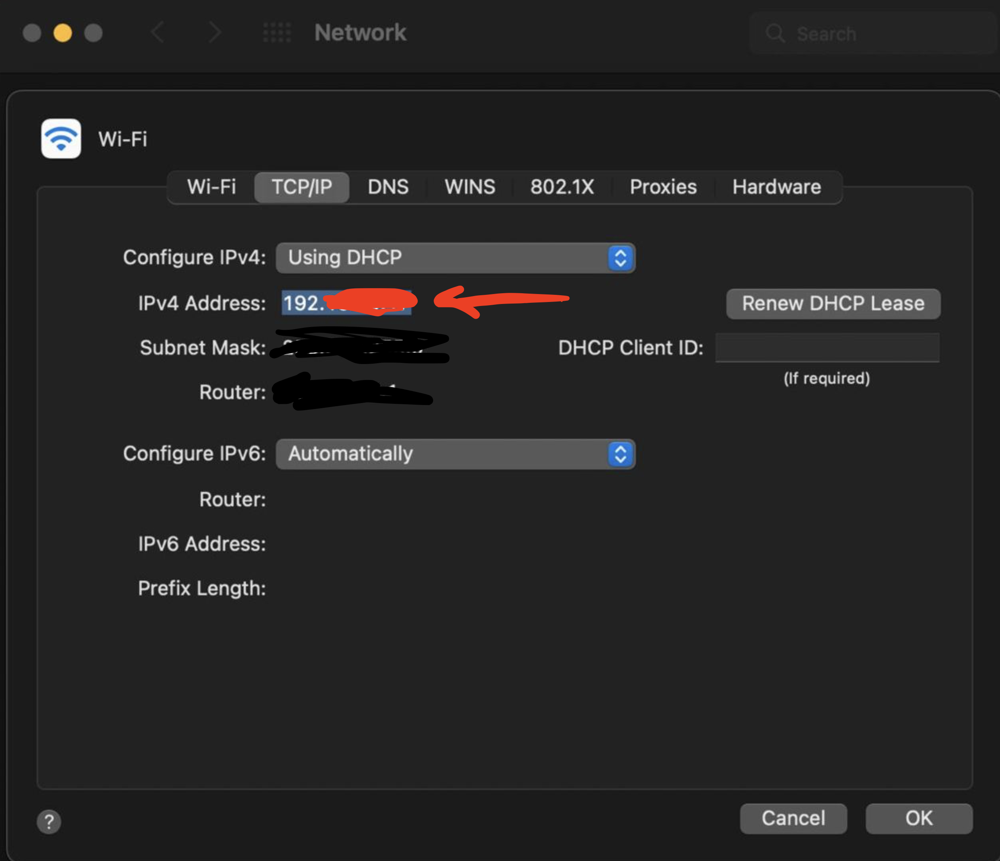

## Deploy and Set Up Apache Cassandra Cluster
### Deploy Cassandra Cluster in Docker
It is expected that Docker is installed on the system. 

In terminal cd into .../code and execute
`docker-compose up`

When the cluster sets up, get their container ids with 
`docker ps` and enter one of them with 
`docker exec -it <containerID> bash`

### Configure the Cluster
Enter CQL with `cqlsh` then create the needed keyspace for a tenant with
```
CREATE KEYSPACE data
  WITH REPLICATION = {
  'class' : 'SimpleStrategy',
  'replication_factor' : 3
  };
```
Then create table into the keyspace for our data with 
```
CREATE TABLE data.ddata (
time text,
readable_time timestamp,
acceleration float,
acceleration_x int,
acceleration_y int,
acceleration_z int,
battery int,
humidity float,
pressure float,
temperature float,
dev_id text,
PRIMARY KEY (dev_id, readable_time));
```

after that our nifi cluster is set ready for the data to be put into it.

## Deploy and Confugure Apache NiFi
### Deploy NiFi in a Container

In terminal pull latest Apache NiFi container: `docker pull apache/nifi:latest`


Deploy the container with


`docker run --name nifi -p 8443:8443 -e NIFI_WEB_HTTPS_PORT='8443' -d apache/nifi:latest`

The NiFi will generate a radom username and password. To see it, pen nifi container in terminal with `docker exec -it <container ID> /bin/sh/`

then `cd logs` and `cat nifi-app.log` ctrl+f / cmd+f Username to find the generated credentials.

<p align="center">

go to [https://localhost:8443/nifi](https://localhost:8443/nifi) to see the web interface and log in with the received credentials.

### Deploy Data Ingestion Flow in NiFi
  
Click on “Upload Template” and upload flows from mysimbdp-dataingest.xml . Then select the template on top bar and drag & drop it to deploy.
<p align="center">

You can inspect the comments to see what each part of the flow is doing.
  
  
Before starting the flow, we need to configure connection to the Cassanra cluster. The Flow automatically imports the information (credentials and adresses) of how to connect to the Cassandra cluster, though you are going to need to re-configure it to specify the addresses of the cassandra nodes as your ones will differ.
<p align="center">
  

Go to Controller Services, click on settings and go to Properties, Specify the IP adresses to the ones of the host machine on which the containers of the Cassandra nodes are hosted. Set Cassandra login credentials, default are password: **cassandra**, username: **cassandra**
<p align="center">
  
After setting them click apply and click on the thunder icon to turn on the service.

If you are using mac you can see your Host machines IPs in advanced Network configurations:
<p align="center">
  
