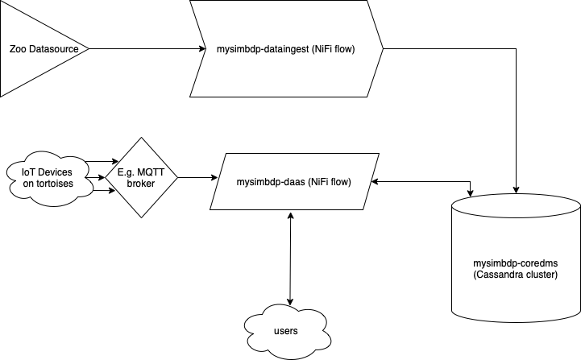
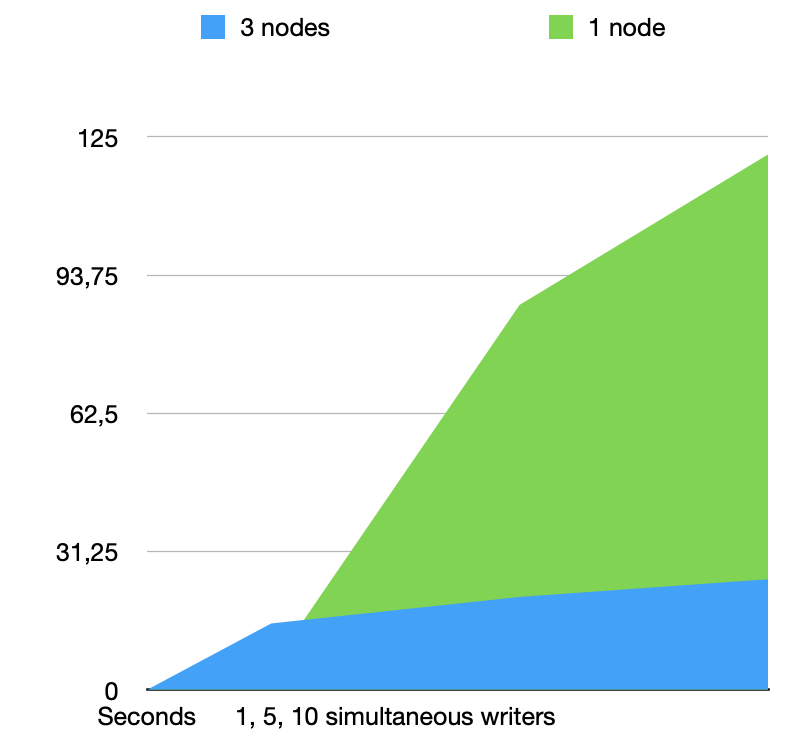

# 1 - Design

### 1.1 Explain your choice of the application domain and corresponding types of data to be supported and technologies for mysimbdp-coredms. Explain under which situations/assumptions, your platform serves for big data workload 

I have chosen dataset of tortoises from Korkeasaari Zoo, becase i found it funny and i like turtles. The data is time sieries IoT data coming from ruuvitag devices measuring environmental values and movement of the tortoises. Data is given as separate CSV files on zoo datasource: https://iot.fvh.fi/downloads/tortoise/ 

Data sample:
```
time,readable_time,acceleration,acceleration_x,acceleration_y,acceleration_z,battery,humidity,pressure,temperature,dev-id
1523145619153,2018-04-08T00:00:19.153000Z,1014.1558065701739,-44,324,960,3007,20.5,1017.15,28.37,C2:9A:9F:E5:58:27
1523145624353,2018-04-08T00:00:24.352999Z,1011.8102588924467,-48,316,960,3007,20.5,1017.14,28.38,C2:9A:9F:E5:58:27
1523145629373,2018-04-08T00:00:29.372999Z,1020.4704797298156,-44,320,968,3007,20.5,1017.16,28.38,C2:9A:9F:E5:58:27
… 
```

Out of all the listed application domains (MongoDB, ElasticSearch, Cassandra, CockroachDB, Apache Hive) Cassandra appeared the most suitable not only because it is the only one i was familiar with through the course tutorials, but because of its general suitability for big data applications thanks to its ability to scale, possibility of reliability configurations and write-performance. When tenants constantly write the data ability to distribute the nodes benefits the application by providing high accessibility of the database that in the end prevents data loss. For time series data we can easily divide the data in columns by it, and then efficiency query the data based on the timestamps. The IoT data is also “standardised” (has constant structure). There are also many other features such as data expiration and compression which can become handy when dealing with constantly growing input of iot data, say if it is being sent every second, wouldn’t it be good idea to compress or even completely delete the data that has been around for a long time and probably unneeded at the moment. The CQL is very similar to SQL which i am already familiar with was also a bonus. Personally i would prefer InfluxDB for the tortoise data, but it was not an option.

### 1.2 Design and explain the interactions among main platform components in your architecture of mysimbdp. Explain which would be the third parties (services/infrastructures) that you do not develop for your platform.

In mysimbdp the key components are mysimbdp-coredms (responsible for storing and managing the data), -dataingest (responsible for reading data from files/messaging systems and ingesting into coredms) and -daas (from which the API’s are supposed to be called to read/write the data to/from the database).


Below is an example how the system would look like at a large scale:
<p align="center">


This system can be configured to interact with Apache Nifi. With NiFi we can configure a dataingestion flow for mysimbd-dataingest, that can  interact with mysimbdp-coredms (running cassandra) by configuring a connection to it (address:port) and providing credentials to be able to execute cql commands remotely on the cluster. In the same way, with NiFi, mysimmdp-daas can be deployed to interact with mysimbdp-coredms as part of a single flow having at both ends “processors” handling calls to APIs in form of a HandleHttpRequest -processor at one end and HandleHttpResponse at the other. The third parties i can think of could be some kind of messaging brokers put in between the IoT device and the receiver node of the daas. Obviously the NiFi and Cassanra platforms are not developed by me, luckily they are opensource and available to use.

### 1.3 Explain a configuration of a cluster of nodes for mysimbdp-coredms so that you prevent a single- point-of-failure problem for mysimbdp-coredms for your tenants

For the custer of Cassandra nodes we use configuration of at least three nodes to provide high availability and fault tolerance. In this scenario the prevention of a single-point-of-failure situation implies that data is replicated among the nodes and that at least one node is available.



### 1.4 You decide a pre-defined level of data replication for your tenants/customers. Explain the level of replication in your design, how many nodes are needed in the deployment of mysimbdp-coredms for your choice so that this component can work property (e.g., the system still supports redundancy in the case of a failure of a node)

The replication level of three (among the three ndoes) would be a sufficient level of redundancy if a node fails, so that the data is possible to retrieve or upload from/to another. In Cassandra this can be easily configured to automatically replicate data among the nodes. 

### 1.5 Explain how would you scale mysimbdp to allow many tenants using mysimbdp-dataingest to push data into mysimbdp

The mysimbdp-dataingest can be be easily scaled by adding nodes to a NiFi cluster thus increasing its power. I provide an example of such deployment in /code/nificluster/docker-compose.yml In the same way we can add more nodes to Cassandra.

# 2  - Implementation

### 2.1 Design, implement and explain one example of the data schema/structure for a tenant whose data will be stored into mysimbdp-coredms

For the incoming data for the tenant i have designed the following data schema:

```
CREATE TABLE data.ddata (
time text,
readable_time timestamp,
acceleration float,
acceleration_x int,
acceleration_y int,
acceleration_z int,
battery int,
humidity float,
pressure float,
temperature float,
dev_id text,
PRIMARY KEY (dev_id, readable_time));
```

The IoT data is stored into “ddata” -table in “data” keyspace. The dev_id (IoT device ID) is set as a row key and since we are dealing with timeseries data, the timestamp (readable_time) is set as a column name, for which Cassandra has a suiting datatype, timestamp. The csv data doesn’t even need to be converted for it. All the other values are then stored with suitable datatypes. 

With this configuration, it is possible to store data of multiple tortoises (by their device IDs), and the timeseries data ordered by their timestamps. This also allows us to later select data by time ranges, which is a benefit.

### 2.2 Given the data schema/structure of the tenant (Part 2, Point 1), design a strategy for data partitioning/sharding, explain the goal of the strategy (performance, data regulation and/or what), and explain your implementation for data partitioning/sharding together with your design for replication in Part 1, Point 4, in mysimbdp-coredms

The data of “data” keyspace is partitioned among all the atleast three nodes with SimpleStrategy, wirst placing the data in the current node and then replicating the data around other nodes. This is sufficient enough if we are keeping data in a single datacenter, what we are doing here.

```
CREATE KEYSPACE data
   ... WITH REPLICATION = { 
   ... 'class' : 'SimpleStrategy',
   ... 'replication_factor' : 3
   ... }
```

### 2.3 Assume that you are the tenant, write a mysimbdp-dataingest that takes data from your selected sources and stores the data into mysimbdp-coredms. Explain what would be the atomic data element/unit to be stored. Explain possible consistency options for writing data in your mysimdbp- dataingest

For mysimdb-dataingest a NiFi flow is configured and deployed. It reads the data which is stored in csv files on datasource webpage. The flow gets file from the url, reads it, splits as part of the nifi flowfile and validates the rows with a regex and then constructs a cql insert command with extracted values, that is executed on a processor that connects to the Cassandra cluster and executes the insert commands. NiFi is here handy  because it is also capable of queuing the data inputs. The atomic data that is stored is defined by the timestamp, i.e. there will be as many different data rows for each device-id as many there are timestamps. In coredms -NiFi we can set the consistency requirement of individual data writes into cassandra nodes, but i don't see a use case for this so i have set it to one.

### 2.4 Given your deployment environment, measure and show the performance (e.g., response time, throughputs, and failure) of the tests for 1,5, 10, .., n of concurrent mysimbdp-dataingest writing data into mysimbdp-coredms with different speeds/velocities together with the change of the number of nodes of mysimbdp-coredms. Indicate any performance differences due to the choice of consistency options 

In order to measure throughtput of the system i have tried a two teployments: one coredms vs cluster of three nodes and varied number of dataingestions: 1, 5, 10. Each instance of dataingestion was writing the same date but into different tables "for different tenants". Here are the results:

<p align="center">
   
```
3 nodes: 
1x4.4MB / 15 s
5x4.4MB / 21 s
10x4.4MB / 25 s

1 node:
1x4.4MB / 0:05 s
5x4.4MB / 1:27 s
10x4.4MB / 2:01 s
```
   
   
>Please note that for running the tests, the containers were housed on an old macintosh laptop.

   
The time is maximum time taken for all dataingestions to finish. The measures were taken from NiFi's interface, i could extract this data from the logs. I also was unable before the deadline to do deploy scale cassandra cluster by adding more nodes (the nodes would exit at deployment for no reason). I had failures when running nifi dataingestion with default heap size (hundreds of megabytes), when setting it to gigabyte it was able to run without failures, this is due to the fact that logging being turned on for the tests during run consumed too much heap.

Since the configuration of for data replication is SimpleStrategy, as the node is running in a single datacenter, the consistency level could not be varied. 

### 2.5 Observing the performance and failure problems when you push a lot of data into mysimbdp- coredms (you do not need to worry about duplicated data in mysimbdp), propose the change of your deployment to avoid such problems (or explain why you do not have any problem with your deployment)

As mentioned in 2.4, the addition of more heap to nifi helped to overkome errors caused by logging. To increase throughput of nifi itself, i would add more nodes to it, at least three with a zookeeper on top. I tried it and it helped, but i wasn't able to deploy this setup with nifi's latest version. I have included the YML for it anyways, just in case.

# 3 - Extension

### 3.1 Using your mysimdbp-coredms, a single tenant can create many different databases/datasets. Assume that you want to support the tenant to manage metadata about the databases/datasets, what types of metadata you would like to support? Can you provide one example of using the metadata to find a dataset?

For example, one type of benefitial metadata could be the average acceleration of a device, this way people at the zoo could find data for the most active tortoises. Acceleration could be joined with time ranges to be able to find datasets for time ranges when tortoises are active.

### 3.2 Assume that each of your tenants/users will need a dedicated mysimbdp-coredms. Design the data schema of service information for mysimbdp-coredms that can be published into an existing registry (like ZooKeeper, consul or etcd) so that you can find information about which mysimbdp-coredms is for which tenants/users

For each tenant their own keyspace or a table within it can be created. A registry would keep track of in which table the data for each tenant is stored, for example defined by the id of a tenant.

### 3.3 Explain how you would change the implementation of mysimbdp-dataingest (in Part 2) to integrate a service discovery feature (no implementation is required) 

In order fo give each tenant his own service automatically, for example as part of a dataflow, it is possible to create a new table or a keyspace for the tenant, e.g. by tenants ID, if it did not exist before. This way each tenant will get his own service when needed.

### 3.4 Assume that now only mysimbdp-daas can read and write data into mysimbdp-coredms, how would you change your mysimbdp-dataingest (in Part 2) to work with mysimbdp-daas?

If reads/writes are abstracted to daas, in dataingest, we would need to instead of writing straight to the database, by connecting to it immediately in it, the dataingest would need to connect to api of the daas and send data there for it to handle. So instead of a processor in the ned of a flow defined in nifi, there would be an endpoint of daas.

### 3.5 Assume that you have both mysimbdp-daas and mysimbdp-dataingest available for tenants/users write the data into mysimbdp-coredms. Explain and provide pros and cons of deployment examples suggesting when a tenant/user should use mysimbdp-daas and mysimbdp-dataingest.

Dataingest can be used when writing data, and should be using when writing extremely large datasets, as we have more control when using it and expext more throughput, while daas should be used when sending smaller amounts of data and more frequently.
